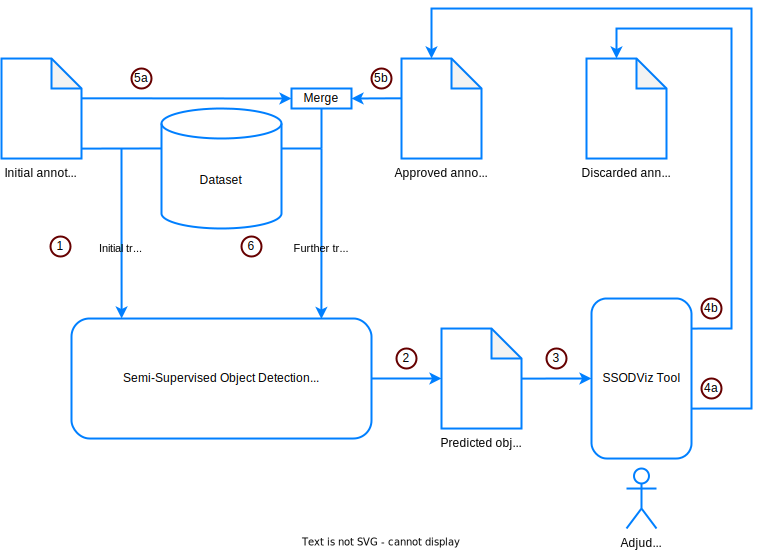

# SSODViz - Visual Annotation Verification for Semi-Supervised Object Detection

The SSODViz application is an open-source tool designed to verify predicted annotations for semi-supervised object detection visually. The main focus is a simple and intuitive design that makes the process of manual confirmation of predicted labels as easy and fast as possible.

For demonstration purposes, we are using a subsample of the images and annotations of the [PubLayNet dataset](https://github.com/ibm-aur-nlp/PubLayNet).


# Run the application

Before you start the application, make sure to install the required Python libraries by running the command:

```
pip install -r requirements.txt
```

Afterward, you can run the application by executing the command:

```
python3 app.py
```

By default, the app will run on http://127.0.0.1:8050/. Open this address in your browser.

# Workflow

Since this application is intended to be used as a verification tool for semi-supervised object detection, we assume that you want to verify the annotations that your model predicted in order to make use of approved/discarded annotations for further training steps and for evaluating your model. The workflow with SSODViz is depicted in the figure and description below.

1. Use the initial annotations for first model training *initial training step* -- constructing the initial object detection model.
2. Predict annotations for a subset of the unlabeled images.
3. Assessment of the predictions using the SSODViz tool.
4. Adjudicating the results via a human-in-the-loop *Adjudicator*: <br>
4a. Approving annotations, if those are correct. <br>
4b. Discarding annotations, otherwise.
5. Merging all labeled data, i. e. initial annotations and approved annotations, into a new training set.
6. Iterative model training, i. e. performing *further training steps*, for constructing object detection models incrementally.



## Configuration

You can set the required paths in the **Configuration** card in the application. Please make sure to either set the paths relative to the directory from where you execute the app or provide absolute paths.


- **PATH_IMAGES** should contain the path to the images you use. This path should contain both the labeled and unlabeled images.
- **PATH_ANNOTATIONS** should contain the path to the CSV file containing the annotations you want to approve/discard.
- **PATH_APPROVED** should contain the path to the CSV file where the approved annotations get stored.
- **PATH_DISCARDED** should contain the path to the CSV file where the discarded annotations get stored.

Note that this application uses a specific CSV format for the annotations. Therefore, it comes with a [conversion](#conversion-from-coco-json-to-csv) tool that can convert the common [COCO JSON](https://cocodataset.org/#format-data) format into the CSV format used by this application.

## Approving / discarding the predicted annotations

Start verifying your model's predictions by clicking on the **Start** button in the **Configuration** card. You can now approve or discard the model's predicted annotations by clicking on the buttons **Approve** / **Discard**. The approved and discarded annotations will automatically be stored in the CSV files given by the paths **PATH_APPROVED** and **PATH_DISCARDED**. If these files already exist, they will be loaded, allowing you to continue/review your previous progress.


## Conversion from COCO JSON to CSV

Since the SSODViz application uses a unique annotation format captured in CSV files, it comes with a script that can convert the common [COCO JSON](https://cocodataset.org/#format-data) format into the CSV format this application is using. Our CSV annotations follow the structure below:

| CSV column        | Meaning                                   |
| ----------------- | ----------------------------------------- |
| image_name        | File name of the image                    | 
| image_id          | ID of the image                           |
| image_width       | Width of the image                        |
| image_height      | Height of the image                       |
| annotation_id     | ID of the annotation                      |
| category          | Category of the annotation                |
| category_id       | Category ID of the annotation             |
| iscrowd           | Similar to "iscrowd" in COCO JSON         |
| bbox_xmin         | X-min of the annotations' bounding box    | 
| bbox_ymin         | Y-min of the annotations' bounding box    | 
| bbox_xmax         | X-max of the annotations' bounding box    | 
| bbox_ymax         | Y-max of the annotations' bounding box    | 
| bbox_width        | Width of the annotations' bounding box    | 
| bbox_height       | Height of the annotations' bounding box   | 
| bbox_area         | Area of the annotations' bounding box     | 
| segmentation      | Segmentation of the annotation            |
| segmentation_area | Segmentation area of the annotation       |

You can either convert the annotations using the SSODViz application or the file **convert_to_csv.py** as a standalone script.

### Conversion using the SSODViz application

You can use the **Convert Annotations** button in the navigation bar of the SSODViz application to convert your [COCO JSON](https://cocodataset.org/#format-data) annotations to the CSV format the application needs.


### Conversion using the **convert_to_csv.py** script

You can also use the **convert_to_csv.py** script to convert your [COCO JSON](https://cocodataset.org/#format-data) annotations.

Example usage:
```
python3 convert_to_csv.py -i=demo/val.json -o=demo/val.csv
```

Usage:
```
usage: convert_to_csv.py [-h] -i INPUT_JSON_FILE [-o OUTPUT_CSV_FILE]

JSON to CSV annotation file converter for the COCO JSON annotation format.

optional arguments:
  -h, --help            show this help message and exit
  -i INPUT_JSON_FILE, --input-json-file INPUT_JSON_FILE
                        Input JSON file.
  -o OUTPUT_CSV_FILE, --output-csv-file OUTPUT_CSV_FILE
                        Output CSV file. Defaults to the name of the input JSON file (with .csv extension instead of .json)
```

