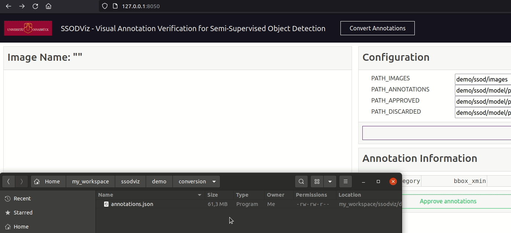

# SSODViz - Visual Annotation Verification for Semi-Supervised Object Detection

This application is designed to verify predicted annotations for semi-supervised object detection visually. The main focus is on a simple and intuitive design that makes the process of manual confirmation of predicted labels as easy and fast as possible.


# Workflow

The following sections describe the intended workflow.

## Conversion from COCO JSON to CSV

Since the SSODViz application uses a unique annotation format captured in CSV files, it comes with a script that can convert the common COCO JSON format into the CSV format this application is using.

You can either convert your COCO JSON annotations using the SSODViz application or the file *convert_to_csv.py* as a standalone script.

### Conversion using the SSODViz application

You can use the "Convert Annotations" button in the navigation bar of the SSODViz application to convert your COCO JSON annotations to the CSV format the application needs.



### Conversion using the *convert_to_csv.py* script

You can also use the *convert_to_csv.py* script to convert your COCO JSON annotations.

Example usage:
```
python3 convert_to_csv.py -i=demo/val.json -o=demo/val.csv
```

Usage:
```
usage: convert_to_csv.py [-h] -i INPUT_JSON_FILE [-o OUTPUT_CSV_FILE]

JSON to CSV annotation file converter for the COCO MS annotation format.

optional arguments:
  -h, --help            show this help message and exit
  -i INPUT_JSON_FILE, --input-json-file INPUT_JSON_FILE
                        Input JSON file.
  -o OUTPUT_CSV_FILE, --output-csv-file OUTPUT_CSV_FILE
                        Output CSV file. Defaults to the name of the input JSON file (with .csv extension instead of .json)
```

## Approving / discarding the predicted annotations


